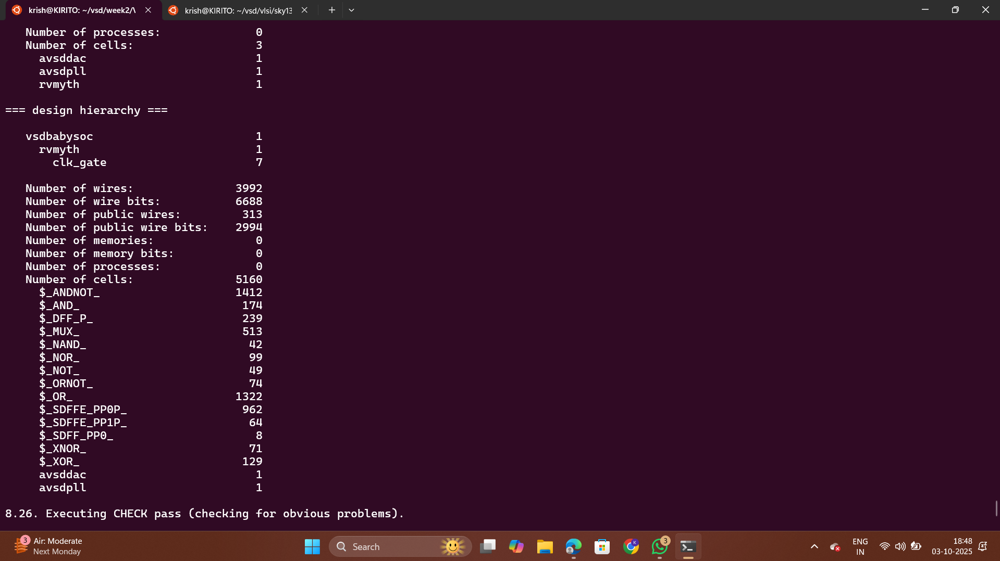
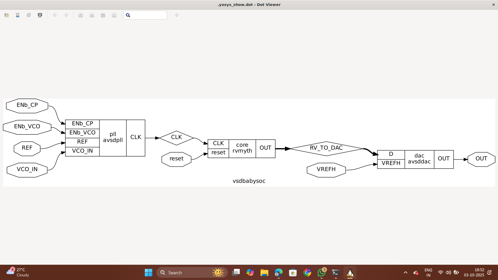

# BabySoC Functional Modelling

## 📌 Objective

To understand **System-on-Chip (SoC) fundamentals** and practice **functional modelling** of the BabySoC using simulation tools:

-   **Icarus Verilog (iverilog)** for compiling and simulating Verilog modules.
    
-   **GTKWave** for analyzing waveforms (.vcd).


### Module Descriptions

<details>
   <summary><strong>2.1 vsdbabysoc.v (Top-Level SoC Module)</strong></summary>
      This is the top-level module that integrates the rvmyth, pll, and dac modules.<br>
  
      
   
   ```verilog
module vsdbabysoc (
   output wire OUT,
   //
   input  wire reset,
   //
   input  wire VCO_IN,
   input  wire ENb_CP,
   input  wire ENb_VCO,
   input  wire REF,
   //
   // input  wire VREFL,
   input  wire VREFH
);

   wire CLK;
   wire [9:0] RV_TO_DAC;

   rvmyth core (
      .OUT(RV_TO_DAC),
      .CLK(CLK),
      .reset(reset)
   );

   avsdpll pll (
      .CLK(CLK),
      .VCO_IN(VCO_IN),
      .ENb_CP(ENb_CP),
      .ENb_VCO(ENb_VCO),
      .REF(REF)
   );

   avsddac dac (
      .OUT(OUT),
      .D(RV_TO_DAC),
      // .VREFL(VREFL),
      .VREFH(VREFH)
   );
   
endmodule
```
      
</details>

   <details>
     <summary><strong>2.2 rvmyth.v (RISC-V Core)</strong></summary>
       
     The rvmyth module is a simple RISC-V based processor. It outputs a 10-bit digital signal (OUT) to be converted by the DAC.<br>

      
      Inputs:
         - CLK: Clock signal generated by the PLL.
         - reset: Initializes or resets the processor.
      Outputs:
         - OUT: A 10-bit digital signal representing processed data to be sent to the DAC.
        
         
   </details>

   <details>
     <summary><strong>2.3 avsdpll.v (PLL Module)</strong></summary>
     The pll module is a phase-locked loop that generates a stable clock (CLK) for the RISC-V core.<br>
     
      
```verilog
module avsdpll (
   output reg  CLK,
   input  wire VCO_IN,
   input  wire ENb_CP,
   input  wire ENb_VCO,
   input  wire REF
);
   real period, lastedge, refpd;

   initial begin
      lastedge = 0.0;
      period = 25.0; // 25ns period = 40MHz
      CLK <= 0;
   end

  // Toggle clock at rate determined by period
   always @(CLK or ENb_VCO) begin
      if (ENb_VCO == 1'b1) begin
         #(period / 2.0);
         CLK <= (CLK === 1'b0);
      end
      else if (ENb_VCO == 1'b0) begin
         CLK <= 1'b0;
      end 
      else begin
         CLK <= 1'bx;
      end
   end
   
   // Update period on every reference rising edge
   always @(posedge REF) begin
      if (lastedge > 0.0) begin
         refpd = $realtime - lastedge;
         // Adjust period towards 1/8 the reference period
         //period = (0.99 * period) + (0.01 * (refpd / 8.0));
         period =  (refpd / 8.0) ;
      end
      lastedge = $realtime;
   end
endmodule
```
         
         
   </details>

   <details>
     <summary><strong>2.4 avsddac.v (DAC Module)</strong></summary>
     The dac module converts the 10-bit digital signal from the rvmyth core to an analog output.<br>
     
```verilog
module avsddac (
   OUT,
   D,
   VREFH,
   VREFL
);

   output      OUT;
   input [9:0] D;
   input       VREFH;
   input       VREFL;
   

   reg  real OUT;
   wire real VREFL;
   wire real VREFH;

   real NaN;
   wire EN;

   wire [10:0] Dext;	// unsigned extended

   assign Dext = {1'b0, D};
   assign EN = 1;

   initial begin
      NaN = 0.0 / 0.0;
      if (EN == 1'b0) begin
         OUT <= 0.0;
      end
      else if (VREFH == NaN) begin
         OUT <= NaN;
      end
      else if (VREFL == NaN) begin
         OUT <= NaN;
      end
      else if (EN == 1'b1) begin
         OUT <= VREFL + ($itor(Dext) / 1023.0) * (VREFH - VREFL);
      end
      else begin
         OUT <= NaN;
      end
   end

   always @(D or EN or VREFH or VREFL) begin
      if (EN == 1'b0) begin
         OUT <= 0.0;
      end
      else if (VREFH == NaN) begin
         OUT <= NaN;
      end
      else if (VREFL == NaN) begin
         OUT <= NaN;
      end
      else if (EN == 1'b1) begin
         OUT <= VREFL + ($itor(Dext) / 1023.0) * (VREFH - VREFL);
      end
      else begin
         OUT <= NaN;
      end
   end
endmodule
```

         
   </details>


   # Pre-Synthesis Simulation
##Clone the project
```
git clone https://github.com/manili/VSDBabySoC.git
```
## TLV to Verilog Conversion for RVMYTH
Initially, you will see only the rvmyth.tlv file inside src/module/, since the RVMYTH core is written in TL-Verilog.

To convert it into a .v file for simulation, follow the steps below:
```
# Step 1: Install python3-venv (if not already installed)
sudo apt update
sudo apt install python3-venv python3-pip

# Step 2: Create and activate a virtual environment
cd ~/VLSI/VSDBabySoC/
python3 -m venv sp_env
source sp_env/bin/activate

# Step 3: Install SandPiper-SaaS inside the virtual environment
pip install pyyaml click sandpiper-saas

# Step 4: Convert rvmyth.tlv to Verilog
sandpiper-saas -i ./src/module/*.tlv -o rvmyth.v --bestsv --noline -p verilog --outdir ./src/module/
```
Run the following command to perform a pre-synthesis simulation:
```
cd ~/VLSI/VSDBabySoC/

mkdir -p output/pre_synth_sim

iverilog -o ~/VLSI/VSDBabySoC/output/pre_synth_sim/pre_synth_sim.out -DPRE_SYNTH_SIM -I ~/VLSI/VSDBabySoC/src/include -I ~/VLSI/VSDBabySoC/src/module ~/VLSI/VSDBabySoC/src/module/testbench.v
```
Then run:
```
cd output/pre_synth_sim

./pre_synth_sim.out
```
After running the simulation, open the VCD file in GTKWave:
```

cd ~/VLSI/VSDBabySoC/

gtkwave output/pre_synth_sim/pre_synth_sim.vcd

```
## Overview
Pre-synthesis simulation is performed to verify the **functional correctness** of the RTL design before synthesis.  
At this stage, we test the Verilog modules (`vsdbabysoc`, `avsdpll`, `avsddac`, `rvmyth`) together using a **testbench**.  
The goal is to check **reset behavior, clock generation, data flow, and output response**.

---


this shows the signals in the vsdbabySOC testbench. we can see the input signals and the output signals


this shows the reset operation when the reset is high the output is zero and in the initial rest condition

- The **PLL (`avsdpll`)** generates the system clock `CLK` for the `rvmyth` core.  
- `REF` provides a reference signal to the PLL.  
- The PLL divides the reference period by 8 to produce the final **stable clock**.  
- When `ENb_VCO = 1`, the VCO toggles `CLK` at the calculated frequency.  
- Simulation shows proper **clock generation** synchronized with the reference input.


this shows the output of the DAC and the processor the output becomes 1 if the DAC output is greater than 0.5 and it becomes 0 if the DAC output is less than 0.5
- The DAC output depends on reference voltages `VREFH` and `VREFL`. 


this shows the output of the DAC and the processor the output becomes 0 if the DAC output is less than 0.5

# Synthesis using YOSYS
```
read_liberty -lib /home/DINESH/Desktop/Open_Source_EDA_Tool/yosys/lib/sky130_fd_sc_hd__tt_025C_1v80.lib
read_verilog -sv -I src/include/ -I src/module/ src/module/vsdbabysoc.v src/module/clk_gate.v src/module/rvmyth.v

read_liberty -lib src/lib/avsddac.lib

read_liberty -lib src/lib/avsdpll.lib

read_liberty -lib src/lib/sky130_fd_sc_hd__tt_025C_1v80.lib

synth -top vsdbabysoc

write_verilog vsdbabysoc.synth.v

abc -liberty src/lib/sky130_fd_sc_hd__tt_025C_1v80.lib

show

```
used the above code to synthesize the verilog code





# Post Synthesis Simulation
we used iverilog to compile the synthesized code.
```
iverilog -o output/post_synth_sim/post_synth_sim.out \
  src/module/testbench.v \
  vsdbabysoc.synth.v \
  src/module/avsddac.v \
  src/module/avsdpll.v

```
then we run the simulation
```
cd output/post_synth_sim
./post_synth_sim.out

```
View waveforms in GTKWave
```
gtkwave dump.vcd

```
the output waveform of post synthesis simulation


